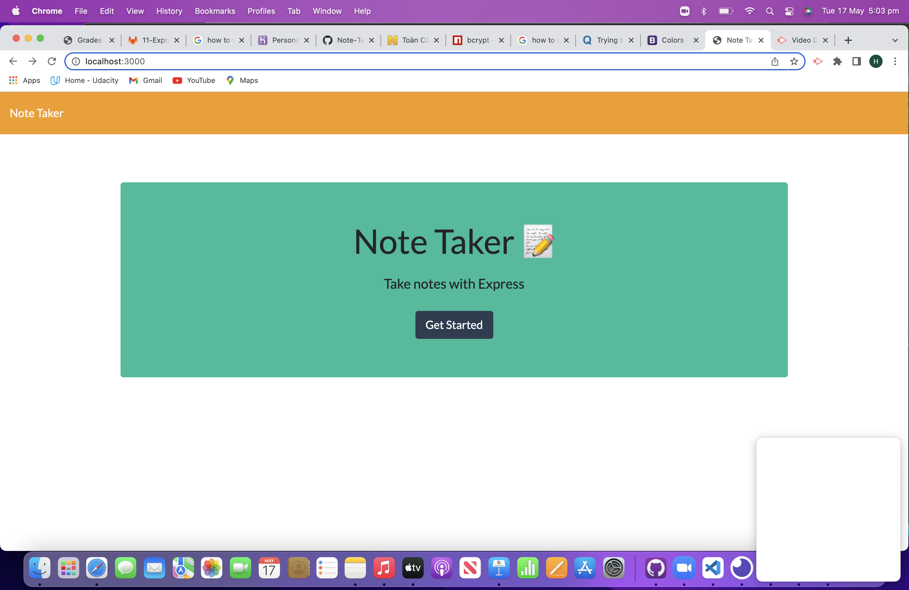
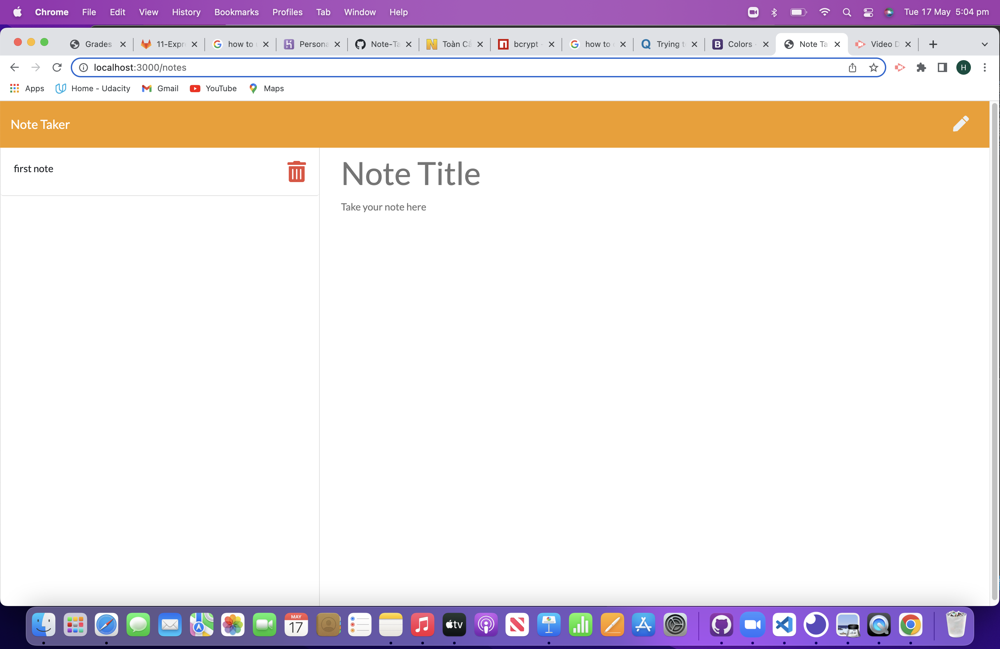

# Homework-Week-11: Note Taker using express
## Description

This asssignment is about creating an application uses an express backend and save and retrieve note data from a JSON file.This is a simple Note Taker application that allows users to add, view saved notes and also delete the notes if the user don't need that note anymore.

## Table of Contents

- [User Story](#user-story)
- [Acceptance Criteria](#acceptance-criteria)
- [Screenshot](#screenshot)
- [Walkthrough Video](#walkthrough-video)
- [Credits](#credits)
- [License](#License)

# User Story

```md
AS A small business owner
I WANT to be able to write and save notes
SO THAT I can organize my thoughts and keep track of tasks I need to complete
```

## Acceptance Criteria

```md
GIVEN a note-taking application
WHEN I open the Note Taker
THEN I am presented with a landing page with a link to a notes page
WHEN I click on the link to the notes page
THEN I am presented with a page with existing notes listed in the left-hand column, plus empty fields to enter a new note title and the note’s text in the right-hand column
WHEN I enter a new note title and the note’s text
THEN a Save icon appears in the navigation at the top of the page
WHEN I click on the Save icon
THEN the new note I have entered is saved and appears in the left-hand column with the other existing notes
WHEN I click on an existing note in the list in the left-hand column
THEN that note appears in the right-hand column
WHEN I click on the Write icon in the navigation at the top of the page
THEN I am presented with empty fields to enter a new note title and the note’s text in the right-hand column
```

## Screenshot
This is a screenshot of the generated HTML webpage.





## Walkthrough Video


## Credits
- Bootstrap: https://getbootstrap.com/
- NodeJS: https://nodejs.org/en/
- Express: https://expressjs.com/
- Inquirer: https://www.npmjs.com/package/inquirer
- heroku: https://dashboard.heroku.com/apps

## License

MIT License

- Copyright (c) 2022 Xuan Huy Bui.
- Email: huybuixuan87@gmail.com


    
